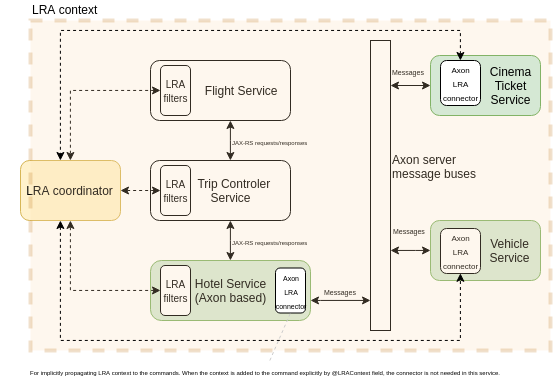
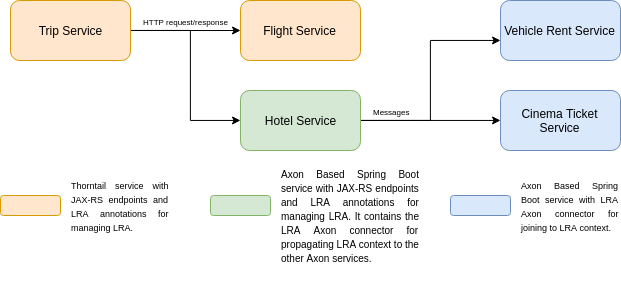
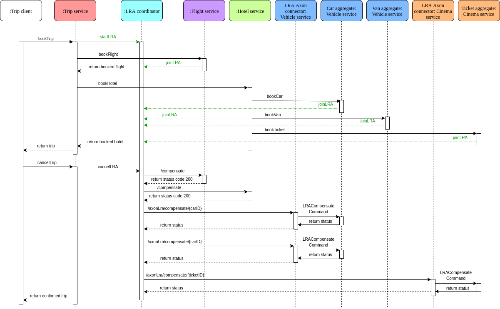

# LRA Axon connector quickstart

This project demonstrating usage of [LRA Axon connector](https://github.com/mkralik3/lra-axon-connector) in Axon based services. Thanks to that, the Axon Aggregates can join the active LRA context and they can be managed by LRA coordinator. 


### USE CASE
The quickstart consists of five services that represent reservation systems. 
It represents a business process that books a trip that consists of flight and hotel reservations. The hotel reservation is extended with making hotel's car reservation and a cinema ticket reservation.
The booking trip service is the leading service where the LRA is started.

#### Project structure


#### Sequence diagram


##### API
Package with the common API. The package contains all necessary Commands, Events and Queries use in Axon services. For simplified, the classes are provided in one Kotlin file.

##### Hotel service
The hotel service has exposed JAX-RS endpoints and using LRA annotations. It is updated service from [hotel-service-axon](https://github.com/mkralik3/hotel-service-axon) repository. The hotel service can be joined to the LRA context in LRA quickstart by `narayana-lra`.

Endpoints:
* http://localhost:8085/hotel

##### Vehicle rent service
The vehicle rent service has two aggregates, Car and Van. The service uses Spring REST. 

Endpoints:
* http://localhost:8085/car
* http://localhost:8085/van
* http://localhost:8085/axonLra/aggregateInfo (Axon LRA connector)

##### Cinema ticket service
The cinema ticket service has only one aggregate and doesn't have any explicit REST endpoints. (only from Axon LRA connector)

Endpoints:
* http://localhost:8086/axonLra/aggregateInfo (Axon LRA connector)

# How to run

###### Workaround for JBTM-3161
```
git clone https://github.com/jbosstm/narayana.git
cd narayana/rts/lra
git checkout 5.10.0.Final
sed -i 's/LRAParticipantRegistry()/public LRAParticipantRegistry()/g' ./lra-proxy/api/src/main/java/io/narayana/lra/client/internal/proxy/nonjaxrs/LRAParticipantRegistry.java
mvn clean install -DskipTest
```
### 1. Build Axon LRA connector
The services uses [Axon LRA connector](https://github.com/mkralik3/lra-axon-connector) to join into LRA. First, it is needs to add it to local repository.
```
git clone https://github.com/mkralik3/lra-axon-connector.git
cd lra-axon-connector
mvn clean install
```

### 2. Build example microservices

 ```
 git clone https://github.com/mkralik3/axon-microservices-example.git
 cd axon-microservices-example
 mvn clean package
 ```
### 3a. Set up via Docker compose up
First, it is needed to copy generated Thorntail services (jar files) from [Narayana LRA quickstart](https://github.com/jbosstm/quickstart/tree/master/rts/lra) to the particular folders `lraResources/flight` and `lraResources/trip`.
```
cp <NARAYANA_QUICKSTARTS>flight-service/target/lra-test-thorntail.jar <microservices-parent>/lraResources/flight/
cp <NARAYANA_QUICKSTARTS>trip-controller/target/lra-test-thorntail.jar <microservices-parent>/lraResources/trip/
```

After that, run the command:
```
docker-compose up
```
During starting, the errors can appear in the log. It is due to the fact, that Axon Server is not ready yet but Axon services want to connect to it. When the Axon services are successfully connected to the Axon server, you will see `AxonServerEventStore  : open stream: 0
` in the log.


### 3b. Set up manually
Each service run in a separate window, we will use the logs for the explanation use case.
```
docker run -it --rm --name my-axon-server -p 8024:8024 -p 8124:8124 axoniq/axonserver:4.2
java -jar <lraCoordinator> -Dswarm.http.port=8080
java -jar lraResources/flight/lra-test-thorntail.jar -Dswarm.http.port=8083 -Dlra.http.port=8080
java -jar lraResources/trip/lra-test-thorntail.jar -Dswarm.http.port=8084 -Dlra.http.port=8080
java -jar cinema-service-axon/target/cinema-service-1.0-SNAPSHOT.jar -Dlra.http.port=8080
java -jar vehicle-rent-service-axon/target/vehicle-rent-service-1.0-SNAPSHOT.jar -Dlra.http.port=8080
java -Dorg.apache.tomcat.util.buf.UDecoder.ALLOW_ENCODED_SLASH=true -Dorg.apache.tomcat.util.buf.UDecoder.ALLOW_ENCODED_SLASH=true" -jar hotel-service-axon/target/hotel-service-1.0-SNAPSHOT.jar  -Dlra.http.port=8080 
```
## 4. Client Example

Open logs for every service. The containers in the docker are named so for shows logs use:
```
docker logs -f lra-coordinator
docker logs -f flight
docker logs -f trip
docker logs -f axon-server
docker logs -f hotel
docker logs -f vehlicle
docker logs -f cinema
```

### Create a reservation

###### 4.1.a By client
I highly recommend to use trip-client which is provided by  [Narayana LRA quickstart](https://github.com/jbosstm/quickstart/tree/master/rts/lra):
 ```
 cd <NARAYANA_QUICKSTARTS>
 mvn -f trip-client/pom.xml exec:java -Dservice.http.host="localhost" -Dservice.http.port=8084
 ```

###### 4.1.b Manually
Alternatively, you can call the trip service manually.
For create a trip reservation, you can call the trip service endpoint:

```
curl -X POST http://localhost:8084/?hotelName=TheGrand&flightNumber1=BA123&flightNumber2=RH456
```
After that, for confirm trip, you can call the trip service endpoint:
```
curl -X PUT http://localhost:8084/<TRIP_ID>
```
The trip id is a URL, so it needs to be encoded (e.g. by https://www.urlencoder.org). After that, the command can look:
```
curl -X PUT http://localhost:8084/http%3A%2F%2Flra-coordinator%3A8080%2Flra-coordinator%2F0_ffffac140002_-6ee968a1_5de2c294_4c
```
To cancel trip:
```
curl -X DELETE http://localhost:8084/<TRIP_ID>
```

#### Create a reservation

Create a trip reservation by the trip client or manually but don't confirm it.

After that, you can see in the lra-coordinator http://localhost:8080/lra-coordinator that new LRA context exist (bookTrip).

###### Trip service
The prepared trip with all reservations can be seen here: http://localhost:8084/ . You can see that all reservation are provisioned (but still not confirmed)
###### Flight service
You can see the flight reservations here http://localhost:8083/ .
###### Hotel service
You can see the hotel reservation here http://localhost:8082/hotel

We can see in the hotel service log, that the `CommandDispatchInterceptor` adds LRA context to all commands (CreateCar, CreateVan, CreateTicket)
 which they send to the bus:
```
...
2019-11-30 19:55:45.133 DEBUG 6 --- [nio-8082-exec-1] o.m.l.l.a.i.c.CommandDispatchInterceptor : The method from which the command is dispatching contains LRA context. The context is added to the metadata. Context is [http://lra-coordinator:8080/lra-coordinator/0_ffffac140004_40ea60b1_5de2c859_1b]
2019-11-30 19:55:45.158 DEBUG 6 --- [nio-8082-exec-1] o.m.l.l.a.i.c.CommandDispatchInterceptor : The method from which the command is dispatching contains LRA context. The context is added to the metadata. Context is [http://lra-coordinator:8080/lra-coordinator/0_ffffac140004_40ea60b1_5de2c859_1b]
2019-11-30 19:55:45.265 DEBUG 6 --- [nio-8082-exec-1] o.m.l.l.a.i.c.CommandDispatchInterceptor : The method from which the command is dispatching contains LRA context. The context is added to the metadata. Context is [http://lra-coordinator:8080/lra-coordinator/0_ffffac140004_40ea60b1_5de2c859_1b]
...
```
###### Vehicle service
You can see the vehicle reservation for each entity here http://localhost:8085/car and http://localhost:8085/van

Also, the http://localhost:8085/axonLra/aggregateInfo shows us which participant methods are available for each aggregate in the service. This information is necessary to join to LRA.

In the log, we can see that before the command is handled, the `CommandHandlerInterceptor` looks to the arrived command and since the @LRAContext field 
is not present, the LRA context is used from the command metadata. The same situation happens for `Van` entity.
```
...
2019-11-30 19:55:44.994 DEBUG 6 --- [mandProcessor-0] o.m.l.l.a.i.c.CommandHandlerInterceptor  : JoinLRA annotation is found in the command: [org.axonframework.axonserver.connector.command.GrpcBackedCommandMessage@1485b02].
Security framework of XStream not initialized, XStream is probably vulnerable.
2019-11-30 19:55:45.018 DEBUG 6 --- [mandProcessor-0] o.m.l.l.a.i.c.CommandHandlerInterceptor  : Context Field is not present, the context is used from metadata.
2019-11-30 19:55:45.021  INFO 6 --- [mandProcessor-0] o.m.l.a.m.vehicle.command.Car            : handling CreateCarCmd(id=0_ffffac140004_40ea60b1_5de2c859_1bCAR, name=TheGrandCar, status=PROVISIONAL, type=Car)
...
```
Next in the log, we can see URLs for the participant methods. The null is for participant methods that are not present.
```
...
2019-11-30 19:55:45.517 DEBUG 6 --- [ehicle.query]-0] o.m.l.l.a.i.e.EventHandlerInterceptor    : URLs for join:
Compensate: http://172.20.0.8:8085/axonLra/compensate/0_ffffac140004_40ea60b1_5de2c859_1bCAR
Complete: http://172.20.0.8:8085/axonLra/complete/0_ffffac140004_40ea60b1_5de2c859_1bCAR
Forget: null
Leave: null
After: http://172.20.0.8:8085/axonLra/after/0_ffffac140004_40ea60b1_5de2c859_1bCAR
Status: http://172.20.0.8:8085/axonLra/status/0_ffffac140004_40ea60b1_5de2c859_1bCAR

...
```

###### Cinema service
The cinema service doesn't have exposed REST endpoint (it represents service without REST endpoints).

However, the LRA Axon connector provides information about participant methods on http://localhost:8086/axonLra/aggregateInfo

The log contains similar information as for Vehicle service.


#### 4.2.1 Confirm trip

Now, you can confirm the trip. (Type `n` to the trip client) The lra-coordinator is going to start contact all participants.

After that, you can see in the lra-coordinator http://localhost:8080/lra-coordinator that the LRA is still there but it is in `Closing` state because of some 
participants (`Van` and `Car`) have not completed yet.

When we look on hotel reservation http://localhost:8082/hotel , we can see that the ticket reservation is CONFIRMED but
the car and the van reservation are still confirming. It is because they participant methods return `ParticipantStatus.Completing` status, which means,
that the participants have not completed all necessary actions yet and the lra-coordinator tries to complete it later.

###### Vehicle service
In the log, we can see that the lra-coordinator contact the LRA Axon connector to complete the participant. The LRA Axon connector contacts the Car aggregate
by `LRACompleteCommand`. Aggregate returns the `ParticipantStatus.Completing` because it has not been completed yet. 
The LRA Axon connector processes the result and returns it to the lra-coordinator.
```
...
2019-11-30 20:26:21.218 DEBUG 6 --- [io-8085-exec-10] o.m.l.l.a.i.rest.AxonLraEndpointsSpring  : AXON LRA connector COMPLETE endpoint was called for aggregate id: 0_ffffac140004_40ea60b1_5de2c859_1bCAR
2019-11-30 20:26:21.225 DEBUG 6 --- [io-8085-exec-10] o.m.l.l.a.i.rest.AxonLraEndpointsSpring  : The result of command is going to be processed
2019-11-30 20:26:21.226 DEBUG 6 --- [io-8085-exec-10] o.m.l.l.a.i.rest.AxonLraEndpointsSpring  : PROCESS RESULT: The result type is ParticipantStatus but still in Compensating/Completing state
...
``` 
The same situation happens for Van.

After 1-2minutes, the lra-coordinator contact the LRA Axon connector to check whether the participant is already complete or not. Since the participant provided the status
method, the lra-coordinator contact status LRA Axon connector endpoint. The LRA Axon connector contacts the Car aggregate by `LRAStatusCommand`. Aggregate returns 
the `ParticipantStatus.Completed` status which means that it is completed.

```
2019-11-30 20:26:43.963 DEBUG 6 --- [nio-8085-exec-3] o.m.l.l.a.i.rest.AxonLraEndpointsSpring  : AXON LRA connector STATUS endpoint was called for aggregate id: 0_ffffac140004_40ea60b1_5de2c859_1bCAR
2019-11-30 20:26:43.966 DEBUG 6 --- [nio-8085-exec-3] o.m.l.l.a.i.rest.AxonLraEndpointsSpring  : The result of command is going to be processed
2019-11-30 20:26:43.967 DEBUG 6 --- [nio-8085-exec-3] o.m.l.l.a.i.rest.AxonLraEndpointsSpring  : PROCESS RESULT: The result type is ParticipantStatus
```
The same situation happens for Van.

After that, the LRA is closed and is not present in the lra-coordinator http://localhost:8080/lra-coordinator

We can also see that when the LRA is closed, the lra-coordinator contacts the car participant because it provided the AfterLRA method.

```
...
2019-11-30 20:26:43.977 DEBUG 6 --- [nio-8085-exec-4] o.m.l.l.a.i.rest.AxonLraEndpointsSpring  : AXON LRA connector AFTER endpoint was called for aggregate id: 0_ffffac140004_40ea60b1_5de2c859_1bCAR
...
```
 
When we look after that on hotel reservation http://localhost:8082/hotel , we see that all reservation is already confirmed.

#### 4.2.2 Cancel
When you cancel the reservation instead of confirming, the compensation methods are invoked instead.